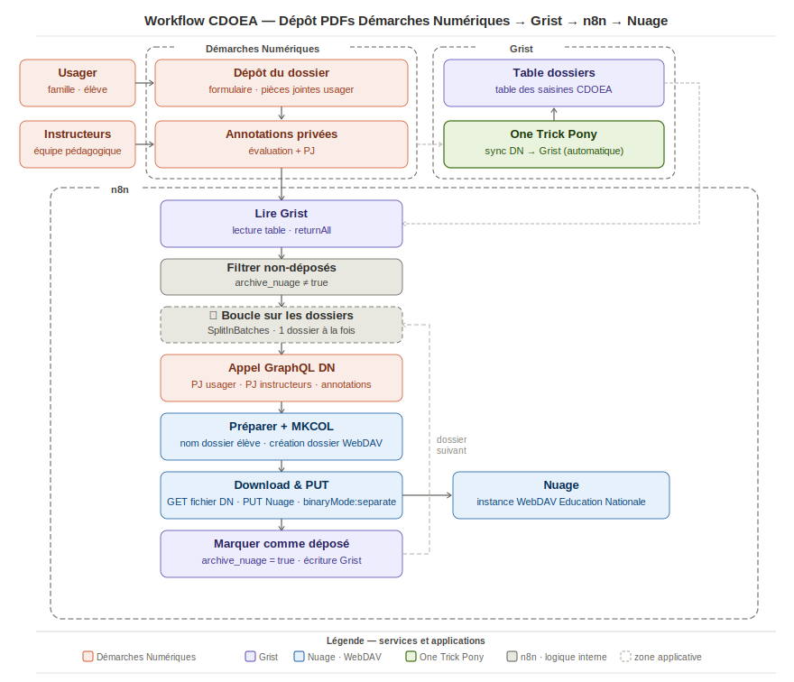

# Workflow CDOEA — Dépôt automatique des PDFs vers Nuage

Workflow n8n pour récupérer automatiquement les pièces jointes d'une démarche sur **Démarches Numériques** et les archiver par dossier demandeur sur une instance **WebDAV**, piloté par **Grist** comme base de données.

## Schéma général



## Services utilisés

| Service | Rôle | Accès |
|---|---|---|
| [Démarches Numériques](https://demarche.numerique.gouv.fr) | Source des dossiers, PJ usagers, annotations et PJ instructeurs | API GraphQL · token Bearer |
| [One Trick Pony](https://onetrickpony.app) | Synchronisation automatique Démarches Numériques → Grist (import des dossiers dans la base) | — |
| [Grist](https://grist.numerique.gouv.fr) | Base de pilotage : liste des dossiers, statut de traitement | API REST · compte de service |
| [n8n](https://n8n.io) | Orchestration du workflow (self-hosted, queue mode) | — |
| WebDAV (Nuage Éducation Nationale ou Nextcloud) | Stockage final des PDFs, organisés par dossier demandeur | Basic Auth · mot de passe d'application |

## Flux

```
Grist (liste des dossiers)
  → Filtrer les non-déposés (GRIST_FIELD_STATUT ≠ true)
  → Boucle par dossier
  → API GraphQL Démarches Numériques
      (PJ usager · PJ instructeurs · annotations privées)
  → MKCOL WebDAV (création du dossier demandeur)
  → Download & PUT (téléchargement et dépôt des fichiers)
  → Grist (GRIST_FIELD_STATUT = true)
```

## Configuration

### Credentials n8n

Créer les credentials suivants dans n8n (Settings → Credentials) puis remplacer les IDs dans le workflow :

| ID dans le workflow | Type n8n | Description |
|---|---|---|
| `CREDENTIAL_ID_GRIST` | Grist API | Compte de service Grist — générer une clé dans Grist : profil → API key |
| `CREDENTIAL_ID_DS_TOKEN` | HTTP Bearer Auth | Token API Démarches Numériques — disponible dans le profil instructeur DN |
| `CREDENTIAL_ID_WEBDAV` | HTTP Basic Auth | Login + mot de passe d'application WebDAV — générer dans Nuage : paramètres → sécurité → mot de passe d'application |

### Variables à remplacer dans le workflow

#### Grist

| Placeholder | Description | Où trouver |
|---|---|---|
| `GRIST_DOC_ID` | ID du document Grist | Visible dans l'URL : `grist.numerique.gouv.fr/o/ORGID/doc/GRIST_DOC_ID` |
| `GRIST_TABLE_ID` | Nom de la table Grist | Onglet de la table dans l'interface Grist |
| `GRIST_FIELD_STATUT` | Champ booléen indiquant si le dossier a déjà été traité | Nom de la colonne dans la table Grist (ex. `archive_nuage`) |
| `GRIST_FIELD_DN_NUMBER` | Champ contenant le numéro de dossier Démarches Numériques | Nom de la colonne dans la table Grist (ex. `dossier_number`) |

#### WebDAV

| Placeholder | Description | Exemple |
|---|---|---|
| `WEBDAV_HOST` | Domaine de l'instance WebDAV | `nuage11.apps.education.fr` |
| `WEBDAV_USER` | Login utilisateur (encodé URL si espaces) | `prenom%20nom` |
| `WEBDAV_BASE_PATH` | Chemin du dossier de destination | `Commissions/Session2025` |

> Les dossiers parents (`WEBDAV_BASE_PATH`) doivent exister avant le premier lancement. Le workflow ne crée que le niveau dossier demandeur.

### Requête GraphQL

La requête dans le nœud **DS: Récupérer les PJ du dossier** récupère toutes les pièces jointes (champs et annotations) d'un dossier. Elle est générique et ne nécessite pas de modification, sauf si vous souhaitez filtrer des champs spécifiques.

### Nommage des fichiers

Par défaut, les fichiers sont nommés `{numero_dossier}_{nom_original_sanitisé}.pdf` (un seul fichier) ou `{numero_dossier}_{index_02}_{nom_original_sanitisé}.pdf` (plusieurs fichiers). Ce comportement est modifiable dans le nœud **Download & prepare**.

## Prérequis techniques

- n8n ≥ 2.6 self-hosted avec **`binaryMode: separate`** dans les settings du workflow (obligatoire — sans ça, le transit de fichiers binaires échoue en queue mode, cf. bug [#25567](https://github.com/n8n-io/n8n/issues/25567))
- Compte de service Grist avec accès lecture/écriture au document
- Token API Bearer Démarches Numériques
- Mot de passe d'application WebDAV

## Notes techniques

- Le MKCOL WebDAV a `continueOnFail: true` pour absorber les 405 (dossier déjà existant lors d'une relance)
- Les noms de dossiers sont sanitisés (`[\s''']` → `_`) pour éviter les erreurs d'encodage WebDAV
- La boucle `SplitInBatches` traite un dossier à la fois ; le workflow reboucle automatiquement jusqu'à épuisement des dossiers non traités

## Licence

[MIT](LICENSE) — libre de réutilisation, modification et redistribution.
